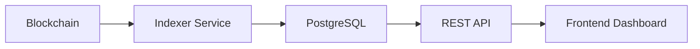

# App Indexer Dashboard

Frontend dashboard for a blockchain indexer. It is designed to visualize indexed on-chain activity through a REST API backed by a PostgreSQL data model.

## Purpose

This project demonstrates a Web3 architecture where blockchain data is:

- collected from on-chain sources
- indexed and processed off-chain
- stored in PostgreSQL
- exposed through a REST API
- consumed by a frontend dashboard

The frontend is intentionally designed to **never interact directly with blockchain RPC providers**.

## Architecture



## Features

- Dashboard overview with key metrics
- Contracts explorer
- Contract detail view
- Events explorer with filtering
- Event detail view with decoded and raw payloads
- Wallet activity tracking
- Indexer sync status and health view

## Tech Stack

- React
- TypeScript
- Vite
- Tailwind CSS
- TanStack Router / TanStack Start
- Component-based architecture
- Mock service layer ready for API integration

## Frontend Data Model

The UI is structured around the following entities:

- `Contract`
- `IndexedEvent`
- `WalletSummary`
- `SyncStatus`
- `SyncLogEntry`
- `DashboardOverviewStats`

These models are aligned with the expected backend API.

## Planned API Integration

The application is designed to integrate with endpoints such as:

```http
GET /api/overview
GET /api/contracts
GET /api/contracts/:id
GET /api/events
GET /api/events/:id
GET /api/wallets
GET /api/wallets/:address
GET /api/wallets/:address/events
GET /api/sync-status
GET /api/sync-logs
```

The current version uses a mock service layer with compatible response shapes.

## Current State

- Uses mock data only
- No backend integration yet
- No blockchain RPC usage from the frontend
- No wallet connection
- No authentication layer

The data flow and UI structure are already organized for future API integration.

## Getting Started

### Install dependencies

```bash
npm install
```

### Run the development server

```bash
npm run dev
```

### Other useful scripts

```bash
npm run build
npm run preview
npm run lint
npm run format
```

## Project Structure

```text
src/
  components/
    common/
    events/
    layout/
    ui/
  hooks/
  lib/
  mocks/
  pages/
  routes/
  services/
  types/
```

## Design Principles

- Backend-first architecture
- No direct blockchain access from the frontend
- Clear separation between data layer and UI
- Reusable and composable components
- Data structures aligned with backend models

## Limitations

- Mock data only
- No real-time updates
- No production API integration yet
- No authentication or access control yet

## Future Improvements

- Integrate with the real backend indexer API
- Add real-time updates with polling or WebSockets
- Add authentication, such as JWT or wallet-based access
- Improve filtering, analytics, and observability views
- Support multiple networks and richer indexer configuration

## Relevance

This project focuses on:

- frontend design for data-heavy systems
- integration-ready architecture for Web3 backends
- separation between on-chain data ingestion and off-chain querying

## License

MIT
